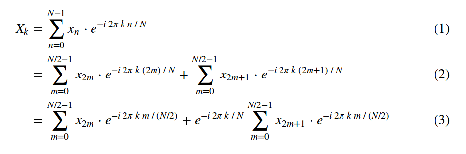
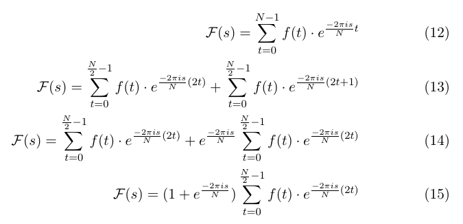

## Splitting up a DFT into two smaller DFTs recursively to produce an FFT

@jakevdp wrote a [great explanation](http://jakevdp.github.io/blog/2013/08/28/understanding-the-fft/) as to how the FFT algorithm works.

Here I want to try out this simple way of creating a web page and point out a possible mistake in the explanation:

